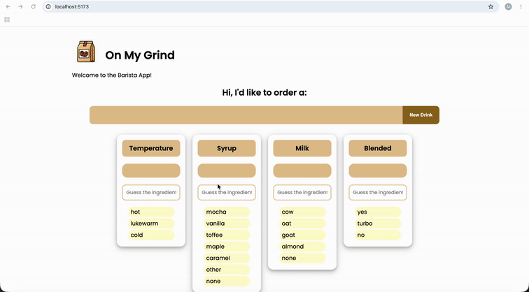

# WEB102 Lab 3 - On My Grind ☕

Submitted by: **Mohamed N. Kadi**

## About

**On My Grind** is an interactive React barista quiz that tests the user's knowledge of popular Starbucks drink recipes.

The app randomly selects a drink and asks the user to guess its temperature, syrup, milk, and blended status. After submitting their guesses, each answer is visually marked as correct or incorrect.

## Features

- Randomly selects a drink from a JSON dataset
- Allows one selection per ingredient category
- Displays the user's current selections
- Checks guesses against the drink's true recipe
- Visually indicates correct and incorrect answers
- Resets the quiz and selections when a new drink is generated
- Allows users to type their answers instead of selecting radio buttons
- Validates typed answers against the available ingredient choices
- Displays an alert when an invalid answer is submitted

## Video Walkthrough

### Original Lab — Radio Buttons

This walkthrough demonstrates the original implementation using radio buttons to select ingredients, check answers, and generate new drinks.

### Stretch Feature — Text Input Validation

This walkthrough demonstrates the stretch feature implementation using text boxes instead of radio buttons, validating typed answers, displaying alerts for invalid choices, and checking answers against the correct drink recipe.

GIFs created with **Kap**.

## Notes

This lab provided practice with:

- React state using `useState`
- Controlled form inputs
- Passing data and functions through props
- Rendering choices dynamically with `.map()`
- Working with objects and arrays in state
- Handling multiple form inputs
- Loading data from JSON
- Comparing user input against stored data
- Dynamically applying CSS classes based on state
- Flexbox and component-based styling

### Stretch Feature — Text Input Validation

Replaced radio buttons with controlled text inputs while keeping the available choices visible.

Used JavaScript's `.includes()` method to validate user answers against the ingredient arrays before checking recipe correctness.

This provided additional practice with controlled components, array methods, and conditional validation.