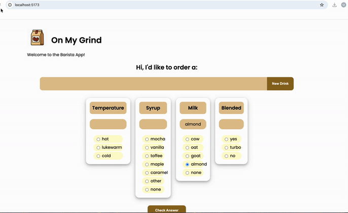

# WEB102 Lab 3 - On My Grind ☕

Submitted by: **Mohamed N. Kadi**

## About

**On My Grind** is an interactive React barista quiz that tests the user's knowledge of popular Starbucks drink recipes.

The app randomly selects a drink and asks the user to guess its temperature, syrup, milk, and blended status. After submitting their guesses, each answer is visually marked as correct or incorrect.

## Features

- Randomly selects a drink from a JSON dataset
- Allows one selection per ingredient category
- Displays the user's current selections
- Checks guesses against the drink's true recipe
- Visually indicates correct and incorrect answers
- Resets the quiz and selections when a new drink is generated

## Video Walkthrough

Here's a walkthrough of the implemented features:

GIF created with **Kap**.

## Notes

This lab provided practice with:

- React state using `useState`
- Controlled form inputs
- Passing data and functions through props
- Rendering choices dynamically with `.map()`
- Working with objects and arrays in state
- Handling multiple form inputs
- Loading data from JSON
- Comparing user input against stored data
- Dynamically applying CSS classes based on state
- Flexbox and component-based styling